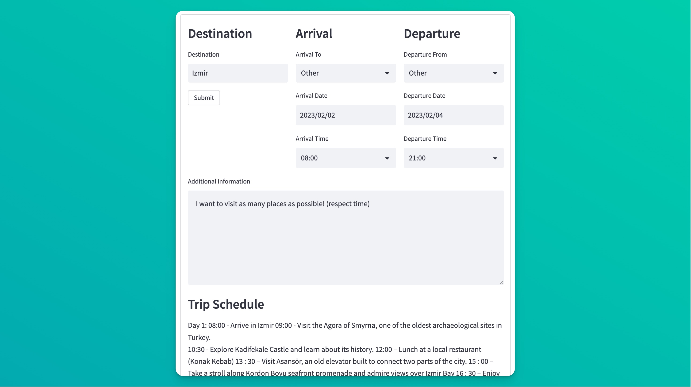

# AI Trip Planner



## Setup

### Install dependencies

```bash
pip install -r requirements.txt
```

### Environment variables
.env-example file is provided. You can copy it to .env and fill the variables.
[Openai api key is required.](https://platform.openai.com/account/api-keys)
```bash
OPENAI_API_KEY=
```

### Run the app

```bash
streamlit run main.py
```
